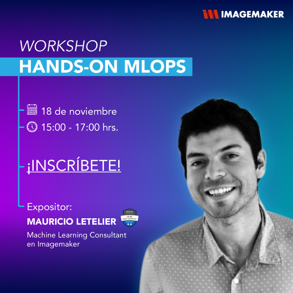
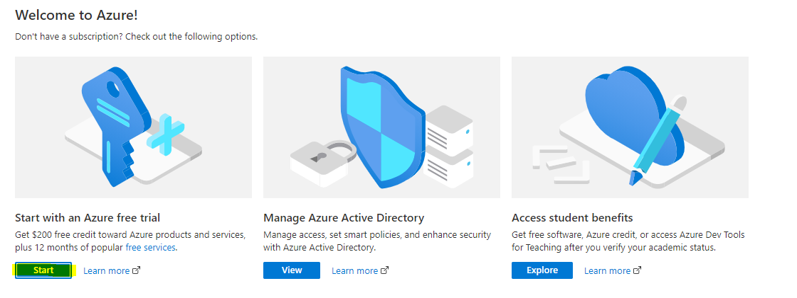

# Hands-on-MLOps!

En Imagemaker creemos que la mejor manera de demostrar nuestros valores, es poniéndolos en práctica. El objetivo de este Workshop es poder adentrarnos en los conceptos fundamentales de MLOps, para luego llevarlos a la práctica utilizando el servicio de Machine Learning de Azure (Azure ML).

# Pero primero... ¿Qué es MLOps?

En el contexto de la implementación de los primeros modelos de machine learning al interior de las organizaciones, se encontraron diferentes problemáticas asociadas a la automatización y produccionalización de los proyectos IA. En este contexto surge una serie de buenas prácticas encargadas de resolver las problemáticas más comunes enfrentadas. Con el objetivo de centrarnos en aquellas más relevantes, a continuación se enumeran las que competen a este Workshop (esto porque existen otras):

* Versionamiento de datos
* Versionamiento de modelos
* Definición de ambientes
* Puesta en producción de modelos

# ¿Cual es el "schedule" del workshop?

La planificación para el workshop es la siguiente:

* 14:00 - 14:15 Bienvenida y presentación Imagemaker
* 14:15 - 14:45 Presentación MLOps en Azure
* 14:45 - 15:30 Hands-on módulo N°1
* 15:30 - 15:45 Break de conversación
* 15:45 - 16:30 Hands-on módulo N°2

# Contenidos

Como se muestra en la sección anterior, los contenidos incluyen una presentación inicial para entender la estructura de Azure machine learning, para luego en los siguientes módulos poner todos estos conceptos en práctica con un "hands-on". En las siguientes secciones se explicita el contenido de los módulos más relevantes.

# Presentación MLOps en Azure

El objetivo de la presentación es comprender los elementos que entrega Azure machine learning, para que en las siguientes secciones entendamos el código que estaremos escribiendo. Esta presentación se divide en dos partes:

* Comprendiendo MLOps: pilares fundamentales para estructurar proyectos de machine learning e interacción entre datos, modelos y código.
* Aplicando MLOps en Azure: se presentarán las estructuras en la que Azure almacena los datos, el registro de modelos y cómo ponerlos en producción.

# Hands-on módulo N°1

En el primer módulo "hands-on" vamos a revisar tanto la creación de los recursos necesarios, como nuestro primer acercamiento a los datos en Azure. A continuación el contenido punto por punto:

* Ingreso al portal Azure para la creación del "Resource Group".
* Creación del recurso Azure machine learning.
* Creación de la instancia en la que se trabajará.
* Configuración del Workspace.
* Creación del dataset.
* Revisión del versionamiento del dataset.
* Estadísticas descriptivas de los datos.

# Hands-on módulo N°2

En el segundo módulo "hands-on" vamos a revisar el entrenamiento de los modelos y como ponerlos en producción. A continuación el contenido punto por punto:

* Definición del ambiente.
* Formulación del problema de machine learning.
* Entrenamiento del modelo utilizando scikit-learn.
* Registro del modelo.
* Verificación de versiones del modelo.
* Produccionalización del modelo.
* Prueba del modelo puesto en producción.

# ¿A quién va dirigido?

A todos aquellos que quieran ampliar sus conocimientos respecto a la ciencia de datos, pero creemos que podría interesarle principalmente a aquellos que quieran reforzar su carrera en los siguientes roles:

* Data Engineers
* Devops Engineers
* Machine Learning Engineers
* Data Analysts
* Data Scientists
* Business Intelligence Professionals
* Software Engineer
* Cloud Solutions Architects
* Analytics Managers

# ¿Qué necesito para el Workshop?

La idea es que al momento de iniciar el Workshop ya tengas creadas la cuenta y las configuraciones necesarias dentro del portal Azure, dado que esto nos va a permitir trabajar con más fluidez. Los pasos que debes seguir son los siguientes:

* En primer lugar debes crear una cuenta en Azure, ¡no te preocupes! es gratis y tienes cupo de 200 dólares el primer mes. Puedes registrarte en el siguiente link https://azure.microsoft.com/en-us/free/
* Luego de esto ingresa al https://portal.azure.com/ para generar una subscripción. Presionar "Start" en la opción de Free Trial.

* Finalmente debes rellenar los datos con tu información personal, después de esto deberías ser redireccionado al portal Azure.

Con estos pasos ¡ya estás oficialmente listo para el Workshop, todo el resto de las configuraciones las vamos a hacer en vivo de manera que podamos trabajar al mismo tiempo!
Además todos los datos y códigos van a ser liberados el mismo día del workshop en este mismo repositorio. Debes buscar la carpeta "workshop" y específicamente el Jupyter Notebook "imagemaker-ml-hands-on.ipynb".

