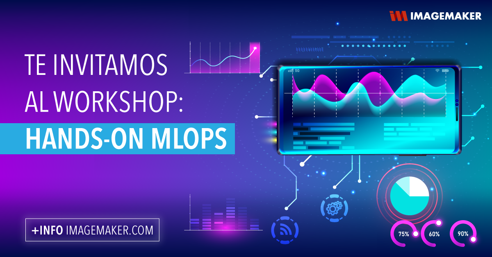

# Hands-on-MLOps!

En Imagemaker creemos que la mejor manera de demostrar nuestros valores, es poniéndolos en práctica
El objetivo de este Workshop es poder adentrarnos en los conceptos fundamentales de MLOps, para luego llevarlos a la práctica utilizando el servicio de Machine Learning de Azure (Azure ML).

# Pero primero... ¿Qué es MLOps?

En el contexto de la implementación de los primeros modelos de machine learning al interior  diferentes problemáticas asociadas a la automatización y produccionalización de los proyectos IA, surge una serie de buenas prácticas encargadas de resolver las problemáticas más acuciantes al interior de las organizaciones. Con el objetivo de centrarnos en aquellas más relevantes, a continuación se enumeran las que competen a este Workshop (esto porque existen otras):

* Versionamiento de datos
* Versionamiento de modelos
* Logging de métricas relevantes
* Definición de ambientes

Además de esto podemos 
# ¿A quién va dirigido?

A todos aquellos que quieran ampliar sus conocimientos respecto a la ciencia de datos, pero creemos que podría interesarle principalmente a aquellos que quieran reforzar su carrera en los siguientes roles:

* Data Engineers
* Devops Engineers
* Machine Learning Engineers
* Data Analysts
* Data Scientists
* Business Intelligence Professionals
* Software Engineer
* Cloud Solutions Architects

# ¿Qué necesito para el Workshop?

La idea es que al momento de iniciar el Workshop ya tengas creadas la cuenta y las configuraciones necesarias dentro del portal Azure, dado que esto nos va a permitir trabajar con más fluidez. Los pasos que debes seguir son los siguientes:

* En primer lugar debes crear una cuenta en Azure, ¡no te preocupes! es gratis y tienes cupo de 200 dólares el primer mes. Puedes registrarte en el siguiente link https://azure.microsoft.com/en-us/free/
* Luego de esto ingresa al https://portal.azure.com/ para generar una subscripción. Presionar "Start" en la opción de Free Trial.

* Finalmente debes rellenar los datos con tu información personal, después de esto deberías ser redireccionado al portal Azure.

Con estos pasos ya estás oficialmente listo para el Workshop, todo el resto de las configuraciones las vamos a hacer en vivo de manera que podamos trabajar al mismo tiempo!

